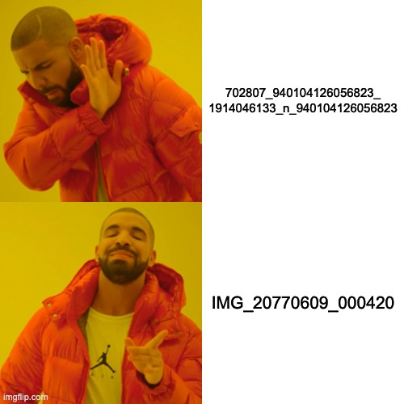
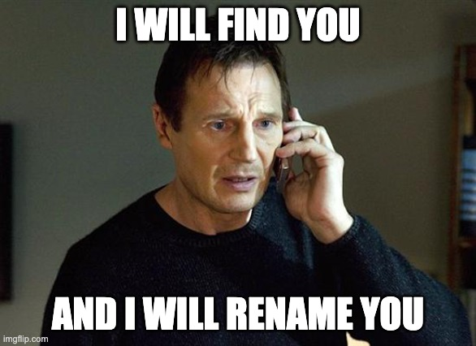
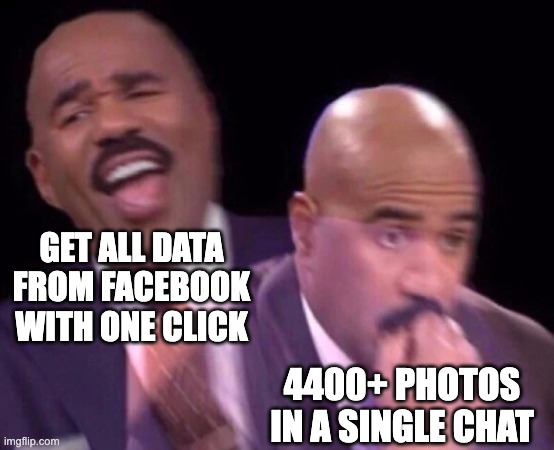
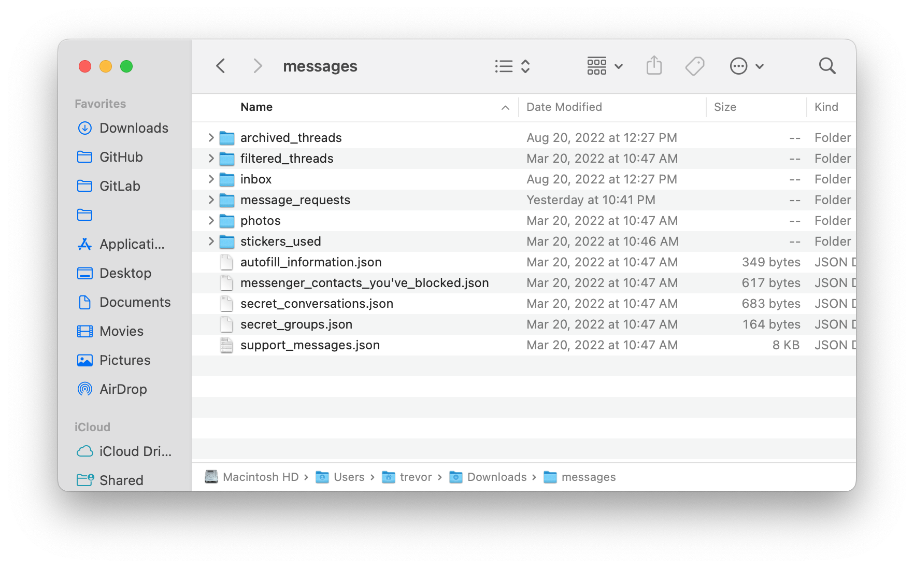
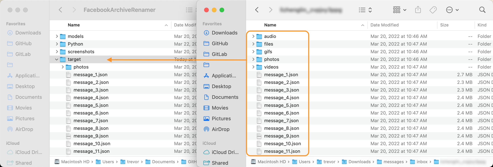

<div align="center">
  


<h1>Facebook Archive Renamer</h1>
<h4>
Rename photos downloaded from Facebook archive to human-readable DateTime format.</h4>


<br>
[](https://forthebadge.com)

<p align="center">
  <a href="#Preview">Preview</a> •
  <a href="#features">Features</a> •
  <a href="#how-it-works">How it works?</a> •
  <a href="#get-started">Get Started</a> •
  <a href="#license">License</a>
</p>
</div>

## Preview
| Before rename | After Rename |
|---|---|
|  |  

## Features

- Rename photos to date time format, e.g. `IMG_20220101_081823`
- Automatically solve duplicate file names by adding one second
- Automatically backup original photos before rename (Python)
- Print messages with timestamp and senders name
- Count total messages




## How it works?

Loop through JSON file to get every message, if the message type is a photo, find it and rename it with the message timestamp.



## Get Started

It's a little complicated, but it can save you time when there are 4400+ photos.

> e.g. I have almost 200,000 messages and 4400+ photos with my ONE friend
> 

### Download your data from Facebook

1. Go to `Settings & privacy` -> `Settings`

    

2. Choose `Your Facebook Information` -> `Download Your Information`

    
    

3. Under `Select file options`, select `JSON` format with `High` quality.
Under `Select information to download`, select `Messages`.

    

4. Request a download

    


### Relocate your data

1. After extraction you will get a folder named `messages`, most of your chat records are inside the `inbox` folder.

    

2. Find the person you are interested in

3. Copy all files under the `USER_NAME` folder and paste them to the `target` folder inside this project.

    

### Select the action u want to perform

1. Open `main.go` in any text editor, e.g. VS Code

2. Most of time you just need to change the const `messageFileName`, this refers to the specific file you want to view or rename from.

    If you want to **rename all the photos**, just uncomment feature 5 and run it, no need to change anything.

    ```go
    const baseFolderPath string = "target/"
    const photosFolderPath string = "photos/"
    const messageFileName string = "message_1.json"
    ```

3. Uncomment the action you want to perform, hit save.


### Run it

1. Run it and wait for the magic happened

    ```sh
    # Run it
    cd ./PATH_TO_THIS_PROJECT
    go run .
    ```
    
2. Thanks me later.

## License
```
Not decided yet.
```

[](https://forthebadge.com)
[](https://forthebadge.com)